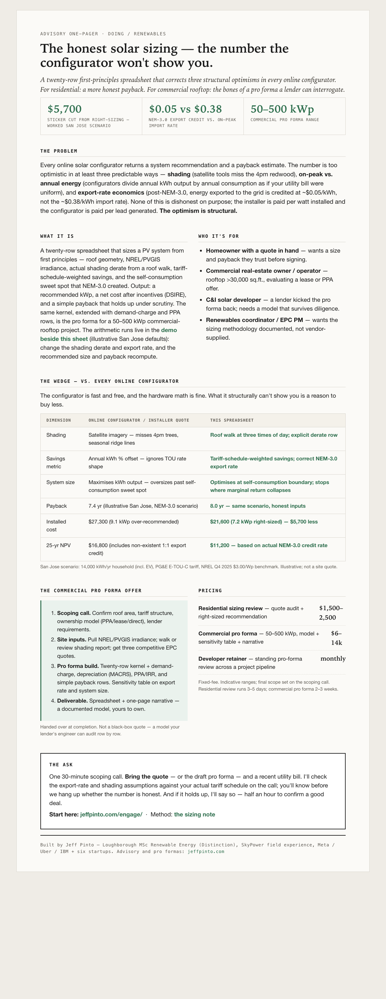

# solar-sizing

**First-principles residential solar sizing.**

A twenty-row spreadsheet beats every online configurator when the configurator has a structural incentive not to be honest. This is the honest arithmetic — first-principles sizing and payback from public, illustrative inputs, with a side-by-side comparison against a configurator-optimistic scenario. Illustrative; not a site quote.

## Demo

Open [`demo.html`](./demo.html) in any browser — double-clicking the file works. It's a single self-contained HTML file: no server, no build step, no network calls. Every default is illustrative, not a quote.

## What else is here

- [`one-pager.html`](./one-pager.html) — the engagement sheet (one Letter page; preview below).
- [`note.html`](./note.html) — the long-form note, rendered for the fleet bundle (its stylesheet lives in the parent bundle, so it opens unstyled here; the canonical version is the source note below).

## Data

Everything in this repo is synthetic or public — no client data, no real metrics, no PII. See [`PRIVACY.md`](./PRIVACY.md).

## Source

The thinking behind this prototype: https://jeffpinto.com/notes/solar-sizing/

## License

MIT — © 2026 Jeff Pinto.

Built by Jeff Pinto · advisory: https://jeffpinto.com/engage/
